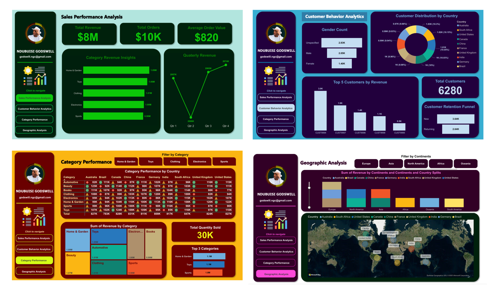
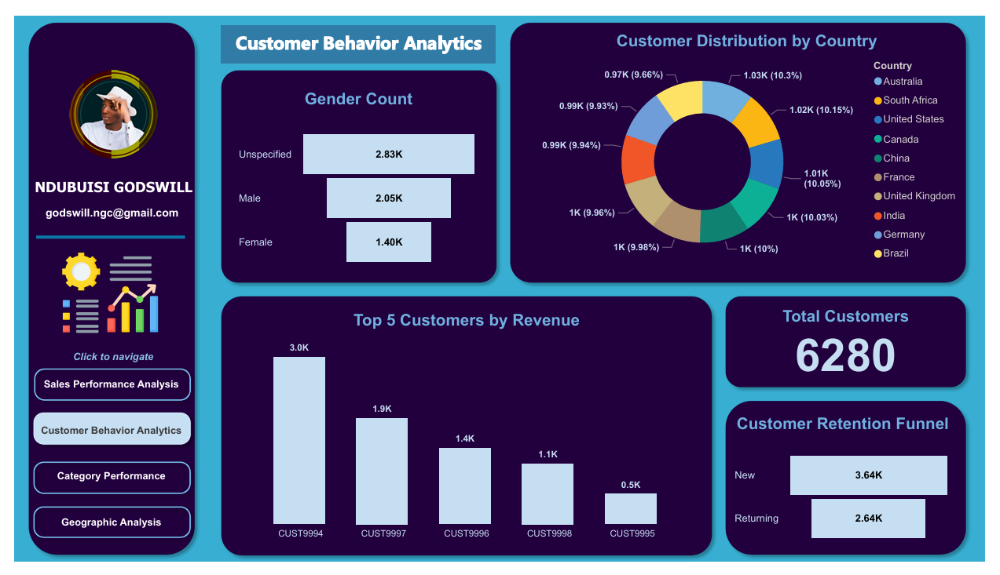
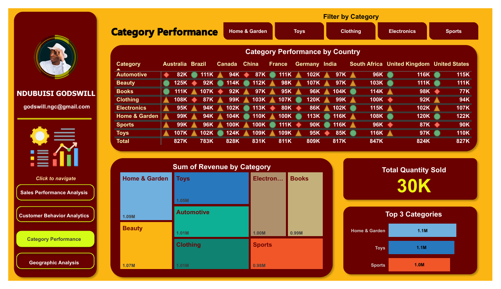
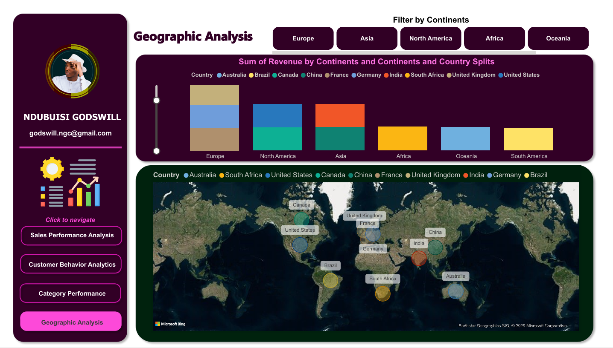

# 📊 E-Commerce Business Intelligence 
An interactive Power BI dashboard for in-depth e-commerce analytics, featuring sales performance, customer behavior, category insights, and geographic distribution. Includes dynamic visuals, cross-filtering, DAX-driven KPIs, and multi-page navigation for a complete business intelligence experience.

## ✨ Project Overview

This project presents a **fully interactive and insight-rich Power BI dashboard** that analyzes a fictional e-commerce dataset. The dashboard is structured across four core business areas:

- 🔹 **Sales Performance Analysis**
- 🔹 **Customer Behavior Analytics**
- 🔹 **Category Performance**
- 🔹 **Geographic Analysis**

Through compelling visuals, smart filtering, and dynamic page navigation, the report transforms raw data into actionable business intelligence.

---

## 🧠 Business Objectives

- Evaluate overall sales health and revenue growth.
- Identify customer buying behavior and retention trends.
- Pinpoint top-performing and underperforming products.
- Understand how geography influences revenue and category sales.

---

# 📈 Sales Performance Analysis

This section of the dashboard provides a high-level overview of the company's revenue performance, enabling stakeholders to assess the business's financial health at a glance.

## 📊 Key Visuals

•	 KPI Cards: Total Revenue, Total Orders, Average Order Value (AOV)

•	 Bar Chart: Revenue by Category

•	 Line Chart: Quarterly Revenue Trend

•	 Interactive Filters: Category selector, Date range

•	 Interactive Filters: Category selector, Date range

## 🧠 DAX Measures & Calculated Columns

• Total Revenue = SUM(ecommerce_orders_2023[Quantity] * ecommerce_orders_2023[Unit Price])

• Total Orders = COUNT(ecommerce_orders_2023[Order ID])

• AOV = DIVIDE([Total Revenue], [Total Orders])

## 🧰 Data Modeling Enhancements

•	No new tables were created in this section.

•	Additional calculated measures were introduced to break down revenue and order trends over time.

## 📌 Insights

Revenue remains relatively consistent across quarters with minor seasonal variations.

Home & Garden, Toys, and Clothing lead in category performance.

## 🧭 Navigation & Interactivity

Clicking any category filters all visuals across the page.

Navigation button links directly to Category or Customer Analysis sections.

# 👤 Customer Behavior Analytics

This report section dives into customer segmentation, gender demographics, and retention trends to understand the lifecycle and value of different customer groups.

##📊 Key Visuals

• Customer Retention Funnel: New vs Returning Customers

• Donut Chart: Gender Distribution

• Bar Chart: Top 5 Customers by Revenue

• KPI Card: Total Unique Customers

## 🧠 DAX Measures & Calculated Columns

FirstPurchaseDate = CALCULATE(MIN(ecommerce_orders_2023[Order Date]), ALLEXCEPT(ecommerce_orders_2023, ecommerce_orders_2023[Customer ID]))

CustomerType = IF(ecommerce_orders_2023[Order Date] = ecommerce_orders_2023[FirstPurchaseDate], "New", "Returning")

Total Customers = DISTINCTCOUNT(ecommerce_orders_2023[Customer ID])

## 🧰 Data Modeling Enhancements
•	A calculated column FirstPurchaseDate was introduced to determine each customer's first transaction.

•	A new column CustomerType classifies customers as "New" or "Returning".

•	Gender distribution was visualized using the existing Gender field.

•	✅ New Table Created: FunnelStage to support customer funnel analysis.

🔢 FunnelStage Table
FunnelStage = 
DATATABLE(
    "Stage", STRING,
    {
        {"All Customers"},
        {"New Customers"},
        {"Returning Customers"}
    }
)
🔢 Measure to Power Funnel Chart
Customer Count by Funnel Stage =
SWITCH(
    SELECTEDVALUE(FunnelStage[Stage]),
    "All Customers", CALCULATE(DISTINCTCOUNT(ecommerce_orders_2023[Customer ID])),
    "New Customers", CALCULATE(DISTINCTCOUNT(ecommerce_orders_2023[Customer ID]), ecommerce_orders_2023[CustomerType] = "New"),
    "Returning Customers", CALCULATE(DISTINCTCOUNT(ecommerce_orders_2023[Customer ID]), ecommerce_orders_2023[CustomerType] = "Returning")
)

📊 Funnel Chart Configuration

•	Category: FunnelStage[Stage]

•	Values: [Customer Count by Funnel Stage]

## 📌 Insights

• Over 3,600 customers are new, while 2,600 are returning, showing good retention.

• Gender is nearly evenly split, with a large number of unspecified entries.

## 🧭 Navigation & Interactivity

All visuals interact with each other on slicer or chart selection.

Buttons lead to Sales or Category Analysis pages.

# 📦 Category Performance

Here, we analyze how each product category contributes to revenue and sales volume, both globally and per country.

## 📊 Key Visuals

• Treemap: Revenue by Product Category

• Column Chart: Quantity Sold by Product

• Table: Category Performance per Country

• Top Cards: Top 3 Categories by Revenue

## 🧠 DAX Measures

Total Quantity = SUM(ecommerce_orders_2023[Quantity])

Revenue = ecommerce_orders_2023[Quantity] * ecommerce_orders_2023[Unit Price]

## 📌 Insights

• Home & Garden, Toys, and Sports lead in both quantity sold and revenue.

• Some regions prefer specific categories (e.g., Automotive in Germany, Beauty in Brazil).

## 🧭 Navigation & Interactivity

• Slicer allows filtering by category to update the map and performance table.

• Buttons guide users to Customer and Sales views.

## 🌍 Geographic Analysis

This page visually represents how revenue is distributed across continents and countries, helping identify geographical strengths.

## 📊 Key Visuals

• Map: Revenue by Country

• Stacked Bar Chart: Revenue by Continent

• Table: Country-wise Revenue and Category Breakdown

## 🧠 DAX Measures & Calculated Columns

Total Revenue = SUM(ecommerce_orders_2023[Quantity] * ecommerce_orders_2023[Unit Price])
Continents = SWITCH(
    TRUE(),
    ecommerce_orders_2023[Country] IN {"United States", "Canada", "Mexico"}, "North America",
    ecommerce_orders_2023[Country] IN {"Germany", "France", "United Kingdom", "Spain", "Italy", "Netherlands"}, "Europe",
    ecommerce_orders_2023[Country] IN {"India", "China", "Japan", "Singapore", "United Arab Emirates"}, "Asia",
    ecommerce_orders_2023[Country] IN {"Australia", "New Zealand"}, "Oceania",
    ecommerce_orders_2023[Country] IN {"Brazil", "Argentina", "Chile"}, "South America",
    ecommerce_orders_2023[Country] IN {"Nigeria", "South Africa", "Egypt", "Kenya"}, "Africa",
    "Other"
)
## 📌 Insights

North America and Europe dominate in total sales.

Australia and Brazil contribute significantly across various categories.

## 🧭 Navigation & Interactivity

Interactive continent and country filters update all visuals in real-time.

Navigation buttons return the user to any previous dashboard section.

## Contact
📧 [Email](mailto:godswill.ngc@gmail.com)  
🔗 [LinkedIn](https://www.linkedin.com/in/godswill-ndubuisi-3341401a2)  
🔵 [Facebook](https://www.facebook.com/godswill.ndubuisi.92)
💬 [Chat on WhatsApp](https://wa.me/message/FB4QE6CIUUF6D1)  

